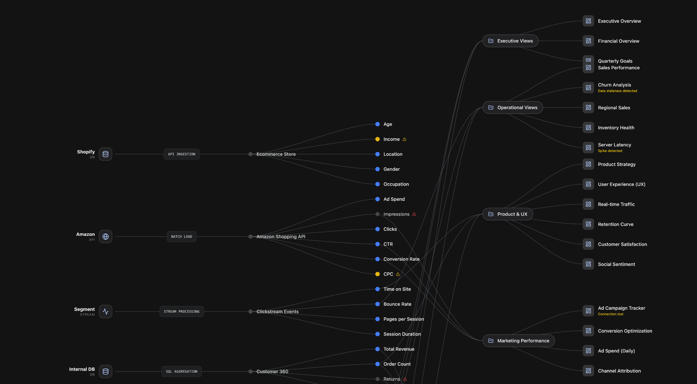
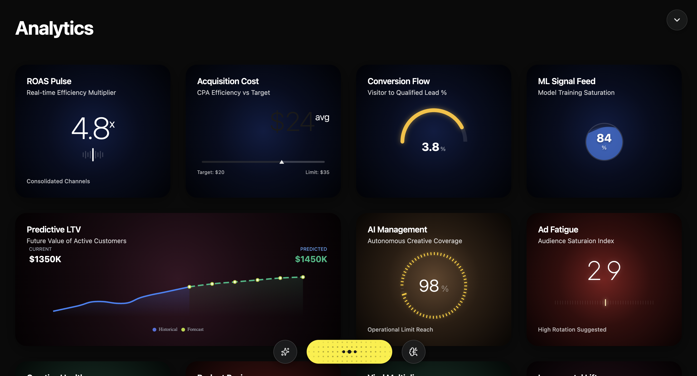
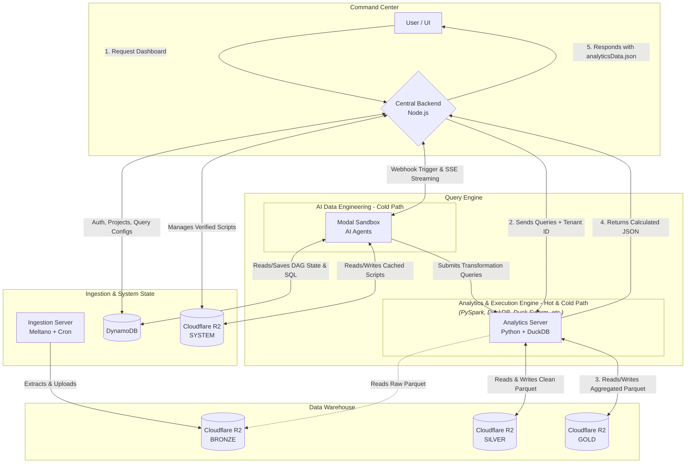

# 🦜 Stats Parrot: Autonomous Data Engineering & Analytics

Stats Parrot replaces rigid ETL pipelines with an **Agentic DAG**. It is a **universal data engine** designed to autonomously manage the entire data lifecycle across diverse modern domains—from **Cybersecurity (XDR/SIEM)** and **Cloud Observability** to **Enterprise BI** and **Predictive Analytics**.

Built for extreme dynamism, it effortlessly orchestrates execution graphs (DAG) capable of scaling seamlessly from thousands to **billions of rows**—without requiring the user to write a single line of SQL or Python.

## 🚀 The Client Journey
1. **Create Project**: Isolate the analytics environment.
2. **Connect Sources**: Link raw data via Meltano (Stripe, PostgreSQL, etc.).
3. **Autonomous Modeling**: The AI infers schemas, cleans anomalies, and engineers features.
4. **Instant Analytics**: Receive an interactive node graph and auto-generated dashboards.

## 🎯 Use Cases

*   **🛡️ Cybersecurity (XDR/SIEM):** Automates log normalization from thousands of sources (Windows, Linux, Cloud). Detects threat patterns and provides instant visualization for SOC analysts.
*   **☁️ Cloud Observability:** Monitors infrastructure telemetery, identifies performance anomalies, and manages alerting pipelines without manual script updates.
*   **📊 Enterprise BI & Analytics:** Replaces legacy ETL with an agentic flow that adapts to new data structures, delivering sub-second dashboards for sales, finance, and operations.
*   **📈 Advanced ML & Statistical Discovery:** Executes complex analytical tasks and machine learning workflows using robust **Python scaffolds**. The system autonomously monitors data patterns, triggering challenger-model retraining in isolated micro-VMs when concept drift is detected.
*   **🛰️ IoT & Industrial Data:** Processes massive sensor streams via the Hot Path, providing real-time monitoring of billion-row datasets with zero token overhead.

### Autonomous DAG & Auto-Generated Insights



---

## 🧠 Architecture: The Autonomous Engine

Stats Parrot replaces static scripts with AI Agents acting as Data Engineers.

### 1. The Autonomous DAG (Cold Path)
An Orchestrator spins up ephemeral **Modal Sandboxes** executing Python agents. This path is triggered on first run or when schema drift is detected.
*   **Data Normalization (Bronze → Silver):** Uses DuckDB to infer schemas, flatten nested JSONs, and drop corrupt records.
*   **Feature Engineering (Silver → Gold):** Profiles Silver data (nulls, min/max). Generates optimized DuckDB `COPY` statements to output aggregated business metrics.
*   **Query Generation:** Maps Gold layer columns to UI widgets (`weather`, `predictive`), generating SQL templates.

### 2. Boilerplates as Scaffolds (Schele)
Running LLMs on raw code generation is expensive and error-prone. Stats Parrot uses **Boilerplates** as robust Python scaffolds that handle all infrastructure heavy-lifting.

*   **Infrastructure Isolation:** The boilerplate (e.g., [query_generator.py]) manages R2 connections, DuckDB lifecycle, schema discovery, and configuration fetching.
*   **LLM as Logic Engine:** The LLM only writes the core transformation logic (~150 tokens) injected into a specific "Phase" of the scaffold. This cuts costs by 90% and ensures 100% reliable execution code.

```python
# Example Boilerplate Scaffold Pattern
  for i, gold_uri in enumerate(gold_uris):
        if not gold_uri: continue
        alias = f"gold_{i}"
        print(f"\n  ➤ Table {i} [{alias}]: {gold_uri}")
        
        try:
            schema_rows = con.execute(f"DESCRIBE SELECT * FROM read_parquet('{gold_uri}')").fetchall()
            print("    Columns:")
            for col in schema_rows:
                print(f"      - {col[0]} ({col[1]})")
        except Exception as e:
            if "404" in str(e) or "NoSuchKey" in str(e):
                print(f"    AGENT_ERROR: Gold Layer not found. Did Feature Engineering fail or skip this?")
            else:
                print(f"    AGENT_ERROR: {str(e)}")
            continue
```

### 3. Data Engineering Hot Path (Zero-Token Execution)
To avoid running expensive LLMs on every ingestion tick, the system utilizes a high-performance **Hot Path**.
*   **Verified Script Caching:** Once an LLM agent successfully generates a transformation script, it is persisted to Cloudflare R2 as a "Verified Script".
*   **Zero Token Usage:** If the Bronze schema fingerprint matches the cached state in DynamoDB, the `Analytics Engine` (triggered by the Orchestrator) skips the LLM reasoning phase entirely and executes the verified Python script directly.
*   **Self-Healing:** If a schema drifts (e.g., new column), the system automatically falls back to the Cold Path to "self-heal" the logic and update the cached script.

```json
{
  "tenantId": "org_123",
  "projectId": "proj_abc",
  "dagState": {
    "normalization": {
       "Olist_Orders": { "hash": "a1b2c3d4", "lastRunAt": "2026-03-13T12:00:00Z" }
    },
    "feature_engineering": {
       "dependencies": ["Olist_Orders"], 
       "outputSchemaHash": "f8e7d6c5"
    }
  }
}
```

*   **Cache Hit:** If the Bronze parquet schema fingerprint matches the DynamoDB state, LLM execution is skipped. Data flows directly into Silver/Gold.
*   **Cache Miss:** If a schema drifts (e.g., new column), only the affected downstream LLM agents spin up to "self-heal" the pipeline logic.

### 4. Admin-Driven Metrics Strategy
Admins steer the generated insights via a centralized `business-metrics-strategy.yml` without writing code. 
*   **Combinatorial Rules:** E.g., If only `Orders` data exists, generate LTV. If `Customers` also exists, generate Churn Risk. This ensures token efficiency and business relevance.

### 5. Concept Drift & ML Sandboxing
Stats Parrot continuously monitors ML models (e.g., Churn prediction) against incoming Silver data.
*   **Automated Retraining:** If prediction error exceeds the threshold (Concept Drift), the Orchestrator spins up a new Modal Sandbox to train a Challenger model on the latest partitioned data, replacing the Champion model seamlessly.

### 6. Sub-Second Analytics (Hot Path)
While the pipeline handles data flow, the UI uses its own **Analytics Hot Path** for live data exploration.
Dashboards don't cache stale data; they store SQL templates in DynamoDB.

```json
{
  "tenantId": "org_123",
  "projectId": "proj_abc",
  "dashboards": [
    {
      "id": "ins_total_sales",
      "title": "Total LTV (All Time)",
      "type": "weather",
      "query": "SELECT ROUND(SUM(total_ltv), 2) as value FROM read_parquet('s3://.../gold/*/*.parquet')"
    }
  ]
}
```

*   **Execution Engine:** When a user opens a dashboard, the centralized `Analytics Engine` (Python + DuckDB) reads the SQL template and executes it directly against the time-partitioned Gold Parquet files (`gold/*/*.parquet`) via Cloudflare R2.
*   **Result:** Live, sub-second analytics without a dedicated data warehouse.

### 7. Multi-Tenant Security & Code Portability
*   **Data Isolation:** All R2 objects are namespaced (`tenants/{tenantId}/projects/{projectId}/...`).
*   **Metadata Isolation:** DynamoDB strict Partition Keys per Tenant.
*   **Execution Isolation:** Ephemeral Modal microVMs destroy state after each run.
*   **Zero Vendor Lock-in:** The entire agent execution layer (Python + DuckDB) is container-agnostic. It can seamlessly migrate from Modal to a self-hosted Kubernetes cluster (e.g., Firecracker microVMs) without backend alterations.


## 🏗 System Architecture Diagram



---
