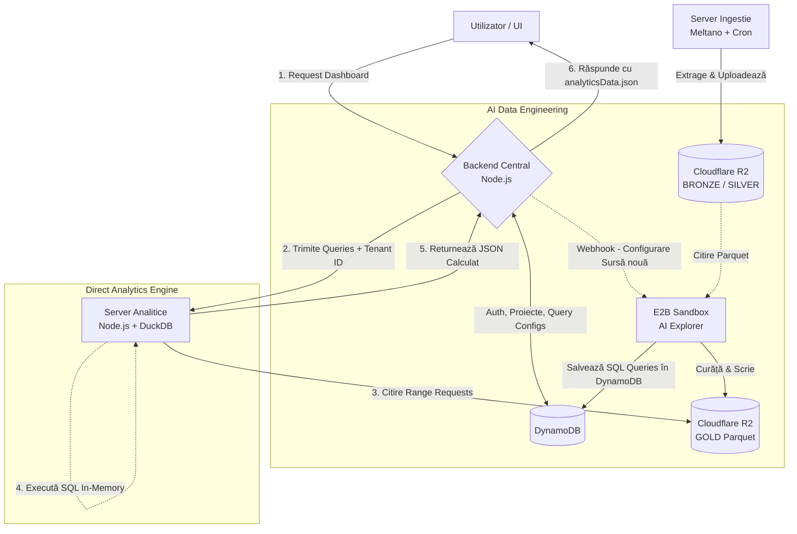

```mermaid
graph TD
    A[Utilizator / UI] -->|1. Request Dashboard| B{Backend Central<br/>Node.js}
    
    %% Baza de Date & Metadate
    B <-->|Auth, Proiecte, Query Configs| Dynamo[(DynamoDB)]
    
    %% Ingestie Separată
    Meltano[Server Ingestie<br/>Meltano + Cron] -->|Extrage & Uploadează| D[(Cloudflare R2<br/>BRONZE / SILVER)]
    
    %% E2B Sandbox - AI Agent
    subgraph ai_engine [AI Data Engineering]
        B -.->|Webhook - Configurare Sursă nouă| E2B[E2B Sandbox<br/>AI Explorer]
        D -.->|Citire Parquet| E2B
        E2B -->|Curăță & Scrie| R2_Gold[(Cloudflare R2<br/>GOLD Parquet)]
        E2B -->|Salvează SQL Queries în DynamoDB| Dynamo
    end

    %% Analytics Engine (On-Demand)
    B -->|2. Trimite Queries + Tenant ID| Analytics[Server Analitice<br/>Node.js + DuckDB]
    
    subgraph direct_analytics [Direct Analytics Engine]
        Analytics -->|3. Citire Range Requests| R2_Gold
        Analytics -.->|4. Execută SQL In-Memory| Analytics
        Analytics -->|5. Returnează JSON Calculat| B
    end
    
    %% Servire via HTTP/SSE
    B -->|6. Răspunde cu analyticsData.json| A
```