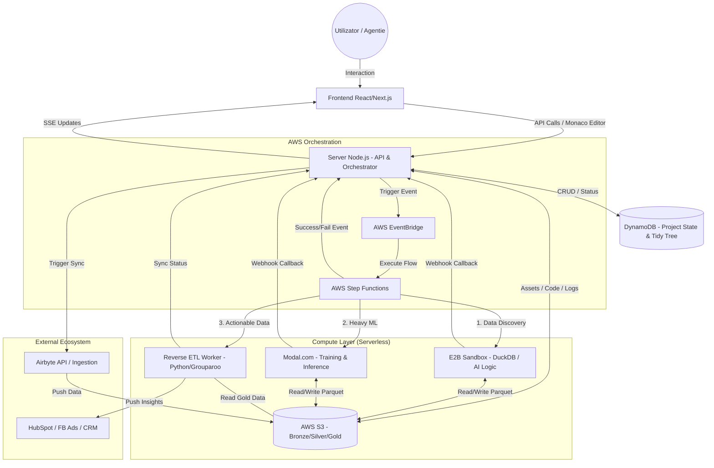

```mermaid
graph TD
    %% User & Frontend Layer
    User((Utilizator / Agentie)) -->|Interaction| FE[Frontend React/Next.js]
    FE -->|API Calls / Monaco Editor| Node[Server Node.js - API & Orchestrator]
    Node -->|SSE Updates| FE

    %% State Management
    Node <-->|CRUD / Status| Dynamo[(DynamoDB - Project State & Tidy Tree)]
    Node <-->|Assets / Code / Logs| S3[(AWS S3 - Bronze/Silver/Gold)]

    %% Orchestration Layer
    subgraph "AWS Orchestration"
        Node -->|Trigger Event| EB[AWS EventBridge]
        EB -->|Execute Flow| SF[AWS Step Functions]
    end

    %% Execution Layer
    subgraph "Compute Layer (Serverless)"
        SF -->|1. Data Discovery| E2B[E2B Sandbox - DuckDB / AI Logic]
        SF -->|2. Heavy ML| Modal[Modal.com - Training & Inference]
        SF -->|3. Actionable Data| RETL[Reverse ETL Worker - Python/Grouparoo]
        
        E2B <-->|Read/Write Parquet| S3
        Modal <-->|Read/Write Parquet| S3
        RETL ---|Read Gold Data| S3
    end

    %% Feedback Loop
    E2B -->|Webhook Callback| Node
    Modal -->|Webhook Callback| Node
    RETL -->|Sync Status| Node
    SF -->|Success/Fail Event| Node

    %% External Systems (In & Out)
    subgraph "External Ecosystem"
        Airbyte[Airbyte API / Ingestion] -->|Push Data| S3
        RETL -->|Push Insights| BusinessTools[HubSpot / FB Ads / CRM]
    end

    %% Triggers
    Node -->|Trigger Sync| Airbyte
```   