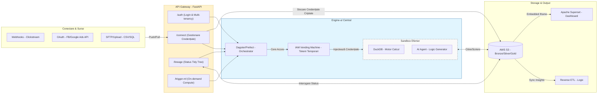

```mermaid
graph LR
    %% Stratul de Conectare (Ingestion Routes)
    subgraph Connectivity [Conectare & Surse]
        S1[Webhooks - Clickstream]
        S2[OAuth - FB/Google Ads API]
        S3[SFTP/Upload - CSV/SQL]
    end

    %% Rutele API Esențiale (Management)
    subgraph API_Gateway [API Gateway - FastAPI]
        R1["/auth (Login & Multi-tenancy)"]
        R2["/connect (Gestionare Credențiale)"]
        R3["/lineage (Status Tidy Tree)"]
        R4["/trigger-ml (On-demand Compute)"]
    end

    %% Orchestrare & Compute
    subgraph Core [Engine-ul Central]
        ORC[Dagster/Prefect - Orchestrator]
        IAM[IAM Vending Machine - Tokeni Temporari]
        
        subgraph Sandbox [Sandbox Efemer]
            DDB[DuckDB - Motor Calcul]
            AGT[AI Agent - Logic Generator]
        end
    end

    %% Stocare & Vizualizare
    subgraph Storage_Layer [Storage & Output]
        S3B[(AWS S3 - Bronze/Silver/Gold)]
        SUP[Apache Superset - Dashboard]
        RETL[Reverse ETL - Logic]
    end

    %% Rutele și Fluxul de Date
    Connectivity -->|Push/Pull| R2
    R2 -->|Stocare Credențiale Criptate| S3B
    
    R1 & R2 & R3 & R4 --> ORC
    
    ORC -->|Cere Acces| IAM
    IAM -->|Injectează Credențiale| Sandbox
    
    Sandbox <-->|Citire/Scriere| S3B
    
    R3 <-->|Interogare Status| S3B
    
    S3B -->|Embedded Iframe| SUP
    S3B -->|Sync Insights| RETL
    
    %% Stiluri
    style Sandbox fill:#f9f9f9,stroke:#333,stroke-dasharray: 5 5
    style Core fill:#e1f5fe,stroke:#01579b
    style API_Gateway fill:#fff2cc,stroke:#d6b656
```