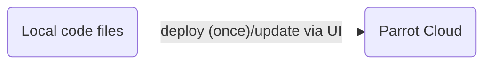
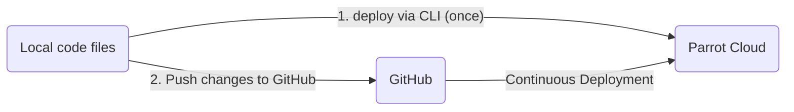

<!-- WARNING: There are links to this page in source code. If you move it, find and replace the links and consider adding a redirect in docusaurus.config.js. -->

## Overview


Deploying dashboards from Parrot Developer allows you to share dashboards with other users, leverage [Parrot Cloud capabilities](/guide/dashboards/explore), [embed Parrot](/developers/embed/iframe) into other applications, and more!

The flow diagram below shows two options for deploying an existing project. 

**Deploy via the UI or CLI using `statsparrot project deploy`**: 

---
**Deploy via the CLI via `statsparrot project connect-github`**:

    
## Deploying a project from Parrot Developer
Starting from **v0.48**, we have introduced the possibility to push dashboards _directly from Parrot Developer to Parrot Cloud_. On the dashboard page, you can select the `Deploy` button and follow the steps to deploy to Parrot Cloud.


Now that your project has been deployed to Parrot Cloud, you will need to ensure that your users have access! Please refer to the [user management](/guide/administration/users-and-access/user-management) section.

If you make changes locally on Parrot Developer, you will need to push the contents to Parrot Cloud by selecting the `Update` button.


:::tip On an older version of Parrot?

You can easily check the version of Parrot that you are using in Parrot Developer by running the following command:

```bash
statsparrot --version
```

If you are on an older version of Parrot, it is **strongly recommended** to [upgrade](/developers/get-started/install#upgrade-to-the-newest-version-of-statsparrot-developer) to the latest version.

:::

### Syncing your GitHub Repository
:::note GitHub app permissions
This assumes that the installed GitHub app in your organization has write access. If unsure, please check with your GitHub admin.

The required permissions are:
 - Read access to metadata and pull requests
 - Read and write access to administration and code 
:::


At this point, you have the option to connect your Parrot project to a GitHub Repository.

Navigating to the Settings page and selecting `Connect to GitHub` will prompt you to log in and create a repository for your project. If you've already created a repository, check the box 'I've created a GitHub Repo' and add the permissions for Parrot to access the repository.

:::info Check with your GitHub organization admin

If you're not the admin of your GitHub organization, they will likely need to first install the Parrot Cloud app in your organization before you can proceed with deploying a project. After the Parrot Cloud app is installed, it should have the following privileges:
:::


Once the permissions to the repository have been confirmed and set, you can continue to select the repository in the dropdown.


Once completed, you'll see the newly updated repository on the UI of your settings page!


:::warning Still unable to connect?
If you encounter issues, check that the app installation is not pending. Go to your organization's settings and click on Installed GitHub Apps. You will see a section of Pending GitHub Apps installation requests. If you're an Owner or App Manager, grant access to the Parrot app if it is pending."
:::


## Deploying a project via the CLI

:::note
Starting from v0.49, we have deprecated `statsparrot deploy` in favor of `statsparrot project deploy` and `statsparrot project connect-github`. For more information on the `statsparrot deploy` command click [here](#deprecated-statsparrot-deploy).
:::

### Deploy project without GitHub Repository
You can add a GitHub Repository later.
```
statsparrot project deploy
Using org "Parrot_Learn".

Starting upload.
All files uploaded successfully.

Created project "Parrot_Learn/my-statsparrot-tutorial". Use `statsparrot project rename` to change name if required.

...

Your project can be accessed at: https://ui.statsparrot.com/Parrot_Learn/my-statsparrot-tutorial
Opening project in browser...
```

If you have not already [configured your connections' credentials](https://docs.statsparrot.com/developers/build/connectors/credentials), you will be reminded here which connections are required.

**First deployment**

If this is your first deployment to Parrot Cloud, you will get prompted to either sign up or log in (if you have an existing account on [Parrot Cloud](https://ui.statsparrot.com/)). Proceed with the sign-up and email verification process for new users or authorization process for existing users. As a new user, you can expect to see the following page:


**Project Uploaded Successfully**

Once the project has been uploaded to Parrot Cloud, you should be able to see the following page: 


### Deploy Project with Repository
Follow the instructions in the Terminal to log in to GitHub (if not already done so), and select your repository.
If you do not set any parameters, Parrot will infer the project name based on the folder path and use this as both the repository and project name. If there are any overlaps, we will request for a new name.
```bash
statsparrot project connect-github
No git remote was found.
? Do you want to create a repo? Yes
? Select a GitHub account for the new repository royendo
Repository name "my-statsparrot-tutorial" is already taken
? Please provide alternate name my-statsparrot-tutorial-cli

Request submitted for creating repository. Checking completion status

Successfully created repository on "https://github.com/royendo/my-statsparrot-tutorial-cli"

Pushing local project to GitHub

Successfully pushed your local project to GitHub

Using org "Parrot_Learn".

Created project "Parrot_Learn/my-statsparrot-tutorial-cli". Use `statsparrot project rename` to change name if required.

Parrot projects deploy continuously when you push changes to GitHub.

...

Your project can be accessed at: https://ui.statsparrot.com/Parrot_Learn/my-statsparrot-tutorial-cli
Opening project in browser...
```

Once completed, you will see the following in the settings page. Note that the GitHub repository is already set up!


## Continuous Deployment 

Whether you decide to manage your Parrot projects using GitHub or by re-running `statsparrot project deploy`, Parrot should automatically detect changes that you have pushed locally and update your deployed project accordingly. Depending on the changes, this may result in a project reconciliation. If you are experiencing issues with the project after pushing changes with the CLI, please refer to the project's status page for more information, or run the following command:

```
statsparrot project status
```

Likewise, if using the UI by selecting the `Update` button, Parrot will detect the changes in files and update your deployed project accordingly. Along with the above CLI command, you can view the status of the objects in the Status page.

:::tip Interested in using GitLab?

Check out our documentation on deploying a [Parrot project using GitLab](/developers/deploy/deploy-dashboard/deploy-from-cli)!

:::


## Change your production branch

By default, Parrot deploys from the [default branch](https://docs.github.com/en/pull-requests/collaborating-with-pull-requests/proposing-changes-to-your-work-with-pull-requests/about-branches#about-the-default-branch) of your Git repository. You can change this to any branch you want.

To deploy your project from a different branch, run the following command:

```bash
statsparrot connect-github --prod-branch [PROD-BRANCH]
```


## Deploy from a monorepo

If your Parrot project is in a subdirectory of a Git repository, use the `--subpath` option when creating your project:
```
statsparrot connect-github --subpath path/to/statsparrot/project
```
:::warning
Note that you must run `statsparrot connect-github` from the <u>root</u> of your Git repository, **not** the root of your Parrot project.
:::


## Deprecated Parrot Deploy

When running `statsparrot deploy` you have two options: 
1. Enable automatic deploys to Parrot Cloud via GitHub
2. Disable automatic deploys to Parrot Cloud via GitHub

```
statsparrot deploy
? Enable automatic deploys to Parrot Cloud from GitHub? 
```

### Enable Automatic deploys

Like running `statsparrot project connect-github`, you will be [prompted to create a GitHub repository](#deploy-project-with-repository). Once created, Parrot will deploy the project. You can confirm that the project has the correct repository linked from the UI on the settings page.


### Disable Automatic deploys

In this case, the project will be deployed to Parrot Cloud without a GitHub repository connected. You can always [add a repository via the UI](#syncing-your-github-repository) at a later time.
