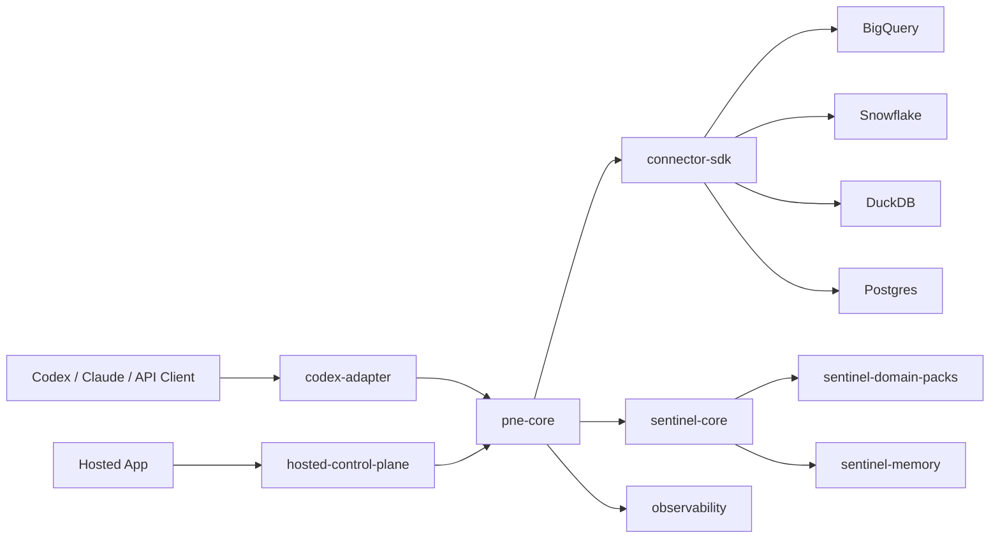

# PNE Modular Migration Plan

## Goal

Transform the current hosted runtime into a modular intelligence stack that can run in two product shapes:

- Fully hosted: StatsParrot owns runtime, connectors, model calls, observability, storage and UI.
- Bring your own warehouse and query engine: customers connect BigQuery, Snowflake, DuckDB, Postgres or another engine, then use PNE through Codex, Claude Code, an API, or a hosted chat surface.

The migration keeps the current hosted service working while extracting reusable packages behind stable contracts.

## Target Modules

## Package Responsibilities

`pne-core`

- Source profiling orchestration.
- Projection planning.
- Insight and query planning.
- Runtime validation orchestration.
- Conversation intent to analysis plan.
- Does not own a specific warehouse or UI.

`connector-sdk`

- Warehouse introspection.
- Safe sampling.
- Query execution.
- Cost and latency metadata.
- Permission and policy descriptors.

`sentinel-core`

- Domain-agnostic review of data artifacts.
- Reviews queries, insights, metrics, features, model runs, visualizations and claims.
- Scores validity, safety, cost, confidence, evidence, actionability and relevance.
- Does not depend on widgets or ecommerce-specific assumptions.

`sentinel-domain-packs`

- Optional semantic priors.
- Ecommerce, marketing, finance, SaaS, forecasting, experimentation, anomaly detection.
- Provides vocabulary, expected metrics, low-signal patterns and preferred analysis shapes.

`codex-adapter`

- Converts conversation turns into PNE intents.
- Returns answer, SQL, evidence, confidence, follow-up questions and optional visualization payloads.
- Supports user-provided LLMs or hosted model calls.

`hosted-control-plane`

- Tenant management.
- R2/artifact storage.
- Runtime state.
- Dashboard hydration.
- Billing and hosted observability.

## Migration Phases

### Phase 1: Define Contracts

- Add `packages/sentinel-core`.
- Add `packages/connector-sdk`.
- Document artifact contracts and review signals.
- Keep backend imports unchanged except for compatibility shims.

Exit criteria:

- Packages compile independently.
- Existing backend build still passes.
- Runtime behavior remains unchanged.

### Phase 2: Move Sentinel Judgment To Core

- Port `BusinessRelevanceModel` into `sentinel-core`.
- Add generic artifact review types.
- Keep backend `SentinelModels.ts` as an adapter initially.
- Add domain packs as data/config, not hardcoded branches.

Exit criteria:

- Backend can produce the same `sentinelModelSignals` through the package.
- Low-relevance dashboard filtering still works.

### Phase 3: Extract Connector Boundary

- Introduce `WarehouseConnector` interface.
- Wrap current `analytics_worker` as a connector implementation.
- Add a BigQuery connector adapter behind the same interface.
- Move runtime validation to connector-driven execution.

Exit criteria:

- PNE can validate against analytics worker or a connector implementation.
- Query execution telemetry has the same shape across engines.

### Phase 4: Extract PNE Core

- Split pure planning logic from Modal route handlers.
- Keep `modal_apps/pne.py` as a thin hosted adapter.
- Move widget contract resolution, projection selection and query planning behind `pne-core` interfaces.

Exit criteria:

- Hosted Modal PNE and local package use the same planning contracts.
- Observability format stays stable.

### Phase 5: Codex Adapter

- Add an adapter that accepts a conversation turn and warehouse context.
- Return natural-language answer, SQL, evidence, caveats and follow-ups.
- Support BYO model and hosted model modes.

Exit criteria:

- A user can ask about an online store warehouse without using the dashboard UI.
- The system can say when LTV, ROAS or another metric cannot be computed from available data.

## Compatibility Rule

Every phase must preserve the current hosted path:

`backend -> PNE Modal -> analytics_worker -> Sentinel signals -> discoveryMetadata -> dashboard`

The new package path is added beside it first, then the hosted path is gradually rewired through the package contracts.

## Product Shape

The commercial product becomes:

- `PNE Hosted`: full managed data intelligence copilot.
- `PNE BYO`: connector SDK plus PNE/Sentinel runtime for a customer's own warehouse and query engine.
- `PNE for Codex/Claude`: adapter for developer-native workflows.

The dashboard becomes one output mode. The stronger product surface is conversational analysis with transparent SQL, evidence, limitations and optional charts.
