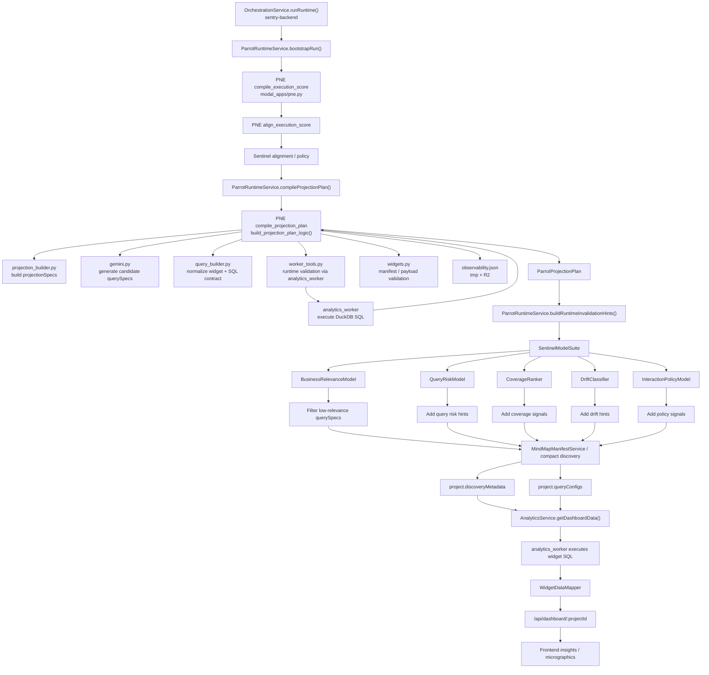
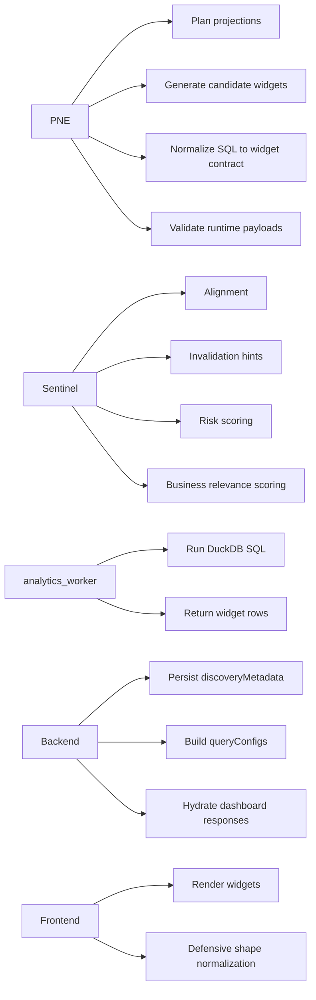
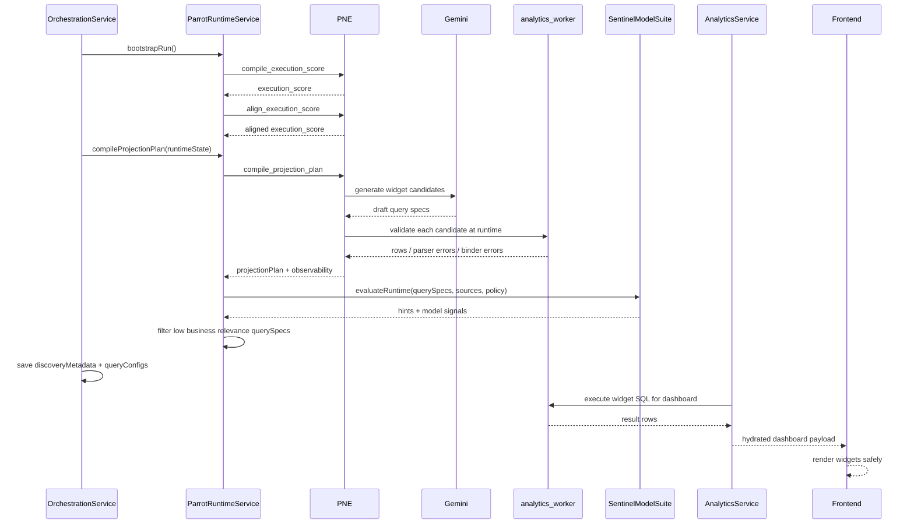

# PNE Runtime Diagram

Acest document descrie fluxul actual pentru `PNE`, `Sentinel`, `analytics_worker`, backend și frontend.

## Overview

## Main Responsibilities

## Current Decision Flow

## Important Notes

- `PNE` este generatorul principal de `querySpecs`.
- `Sentinel` nu mai este doar observator; acum poate filtra query-uri cu relevanță mică pentru dashboardul principal.
- `analytics_worker` este singura sursă de execuție SQL pentru validarea runtime și pentru dashboard hydration.
- `projectionSpecs` există logic și pot influența sursa SQL, dar query-urile finale tot trebuie să fie SQL executabil real pentru worker.
- `observability` este produs în `PNE` și urcat în `R2` pentru debugging persistent.

## Key Files

- `modal_apps/pne.py`
- `modal_apps/pne_core/planner.py`
- `modal_apps/pne_core/gemini.py`
- `modal_apps/pne_core/query_builder.py`
- `modal_apps/pne_core/widgets.py`
- `modal_apps/pne_core/worker_tools.py`
- `sentry-backend/src/application/services/ParrotRuntimeService.ts`
- `sentry-backend/src/application/services/OrchestrationService.ts`
- `sentry-backend/src/application/services/SentinelModels.ts`
- `sentry-backend/src/application/services/AnalyticsService.ts`
- `sentry-frontend/src/components/visuals/Insights.jsx`
