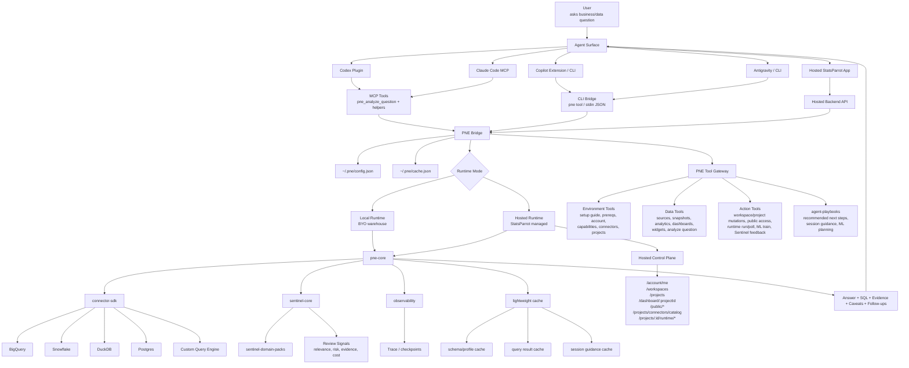
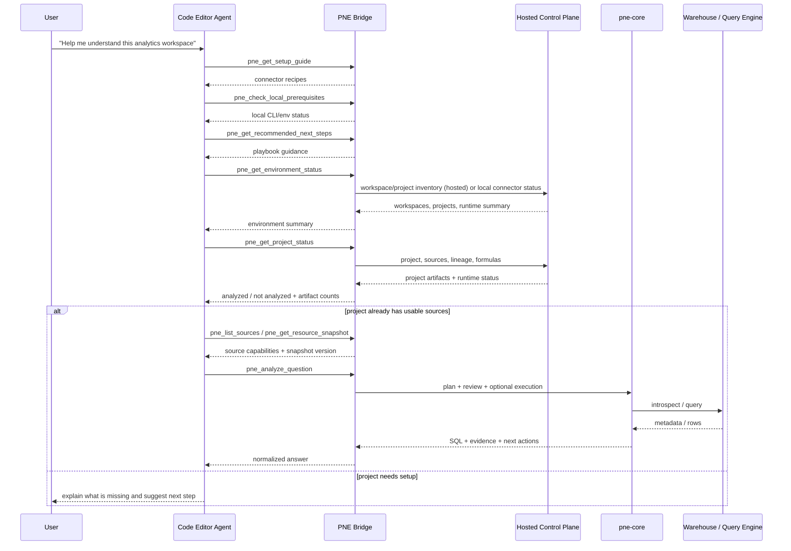
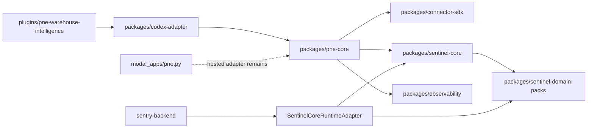
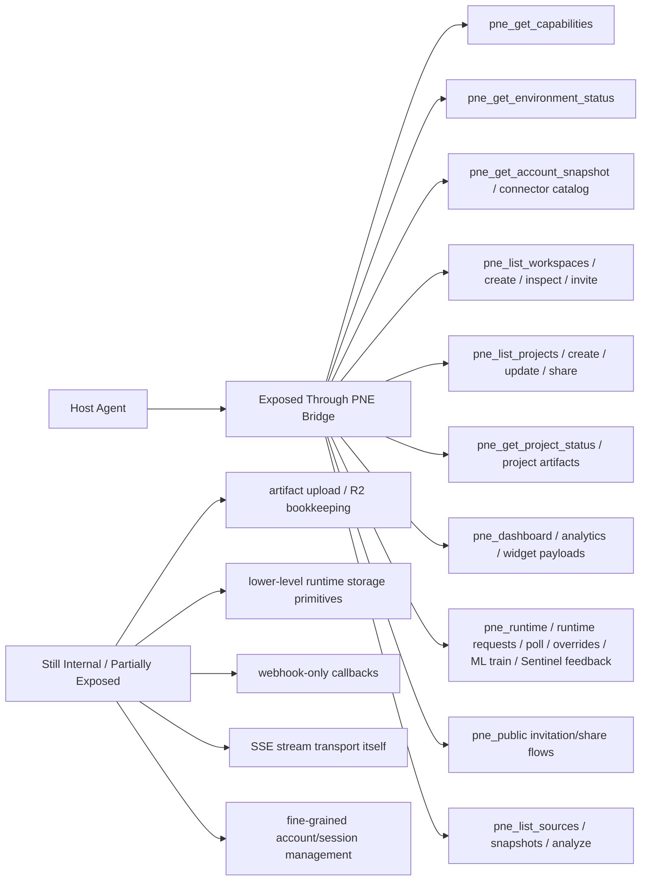
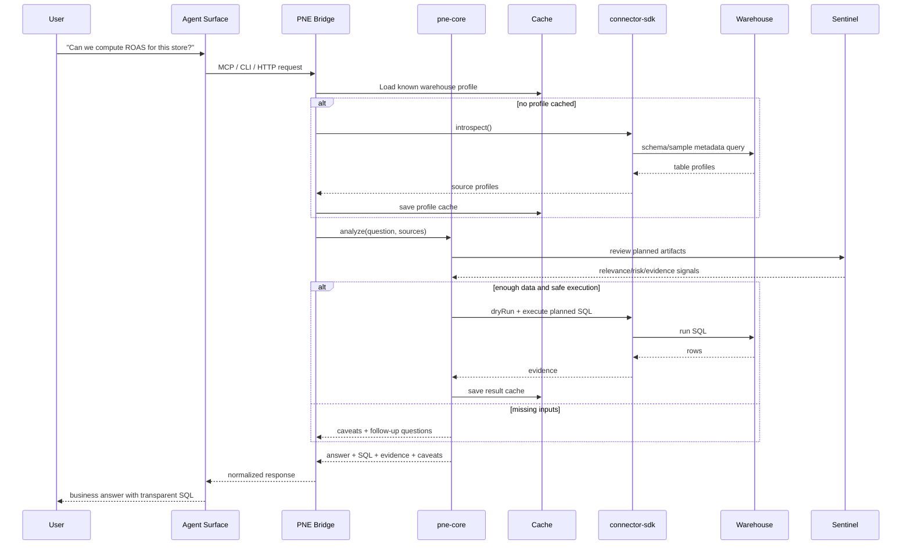
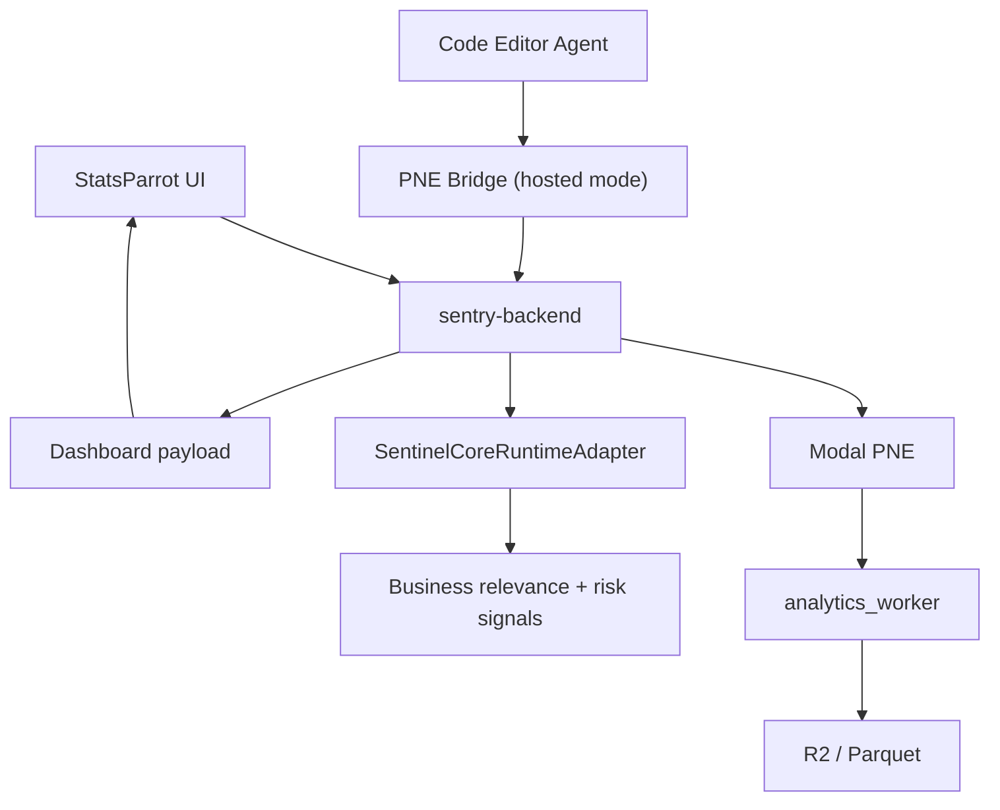
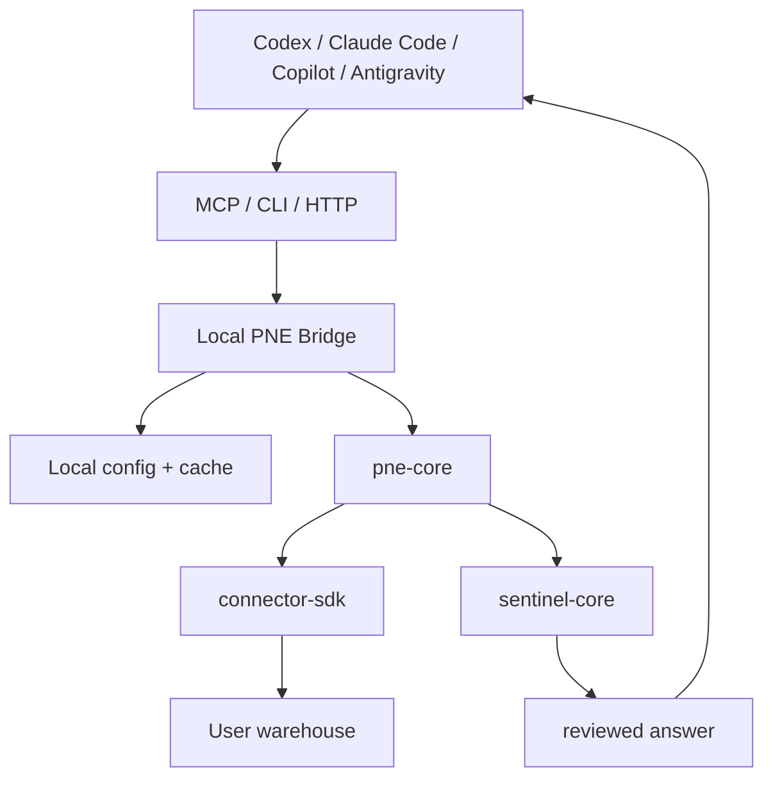
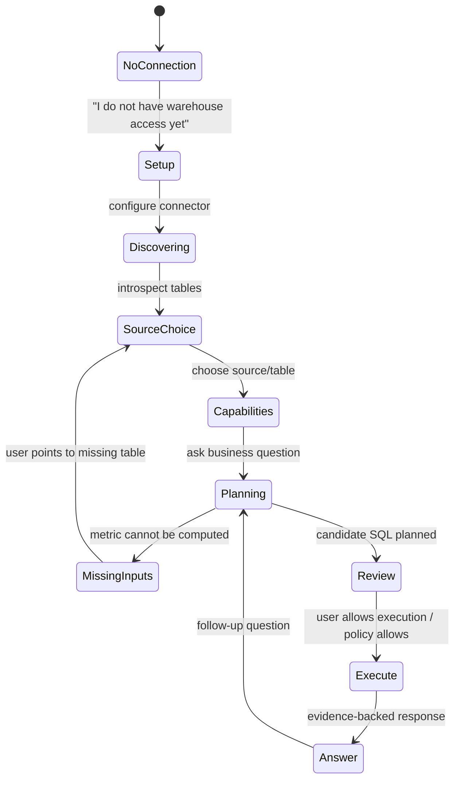

# PNE Updated Application Diagram

Aceasta este arhitectura actualizata pentru directia `PNE as universal warehouse intelligence`, unde aplicatia hosted ramane valida, dar PNE poate fi folosit si din Codex, Claude Code, Copilot, Antigravity sau orice agent care poate vorbi MCP, CLI sau HTTP.

## High Level



## What Was Missing

The old diagram made PNE look too much like a question-answer engine. The missing piece was a **tool-access layer over the internal control plane and runtime state**.

The host agent should not start with:

- "ask PNE a question"

The host agent should start with:

- "what setup paths do I have?"
- "are BigQuery or DuckDB available locally?"
- "is a connector already configured?"
- "do we have a warehouse?"
- "do we have hosted workspaces?"
- "which projects already exist?"
- "which projects already have sources?"
- "which ones already have discovery metadata, projections, query specs, query configs, formulas and runtime artifacts?"

Only after that should it call `pne_analyze_question`.

## Agent Tool Sequence



## Package View



## Exposed vs Internal



Today, the bridge exposes most hosted read and action flows as first-class tools, including account, dashboard, runtime request polling and public-access inspection. The remaining internals are mostly low-level storage, webhook plumbing and raw SSE transport, not the main product zones an editor agent needs to navigate.

## Conversation Flow



## Hosted Mode



Hosted mode keeps the current product path:

`UI -> backend -> PNE Modal -> analytics_worker -> Sentinel review -> dashboard`

The updated hosted agent path is:

`Agent -> PNE Bridge -> hosted control plane -> project/runtime artifacts -> PNE/worker when analysis is needed`

## BYO Warehouse Mode



In BYO mode, credentials stay local. Hosted PNE should receive only the minimum safe context:

- schema/profile
- planned SQL
- aggregate previews where allowed
- Sentinel and observability metadata

## User Conversation States



Example first conversation:

```text
User: What can I do with this warehouse?
PNE: I found Orders, Products and Reviews. I can analyze order volume, delivery delays, review quality and category mix. I cannot compute ROAS because I do not see spend data.
```

Example missing data conversation:

```text
User: Can we compute LTV?
PNE: Not reliably yet. I see customer_id and orders, but I do not see revenue or paid amount. Which table contains order value or payments?
```

Example analysis conversation:

```text
User: Why are reviews getting worse?
PNE: I will compare review score over time, category mix and delivery delay. The first query checks whether review score movement aligns with late delivery share.
```

## Implementation Status

Implemented now:

- `pne-core` contracts and runtime shell
- `connector-sdk` interfaces, registry, SQL function connector, BigQuery, Snowflake, DuckDB and Postgres CLI-backed connectors
- `sentinel-core` artifact review
- `sentinel-domain-packs`
- `observability` recorder and sinks
- `codex-adapter`
- `pne-warehouse-intelligence` plugin scaffold with MCP and CLI bridge
- `pne-bridge` CLI with `init`, `connect`, real connector configs, `capabilities`, `environment`, `sources`, `resources`, `tool`, `serve`, `mcp`, `cache clear`
- hosted inventory tools for workspaces, projects and project analysis status

Still to harden:

- first-class hosted mutation tools such as `run_runtime`, override management and training triggers
- hosted `/analyze` endpoint alignment with the universal envelope
- installer script for `curl -fsSL ... | sh`
- published `npx @statsparrot/pne` package
