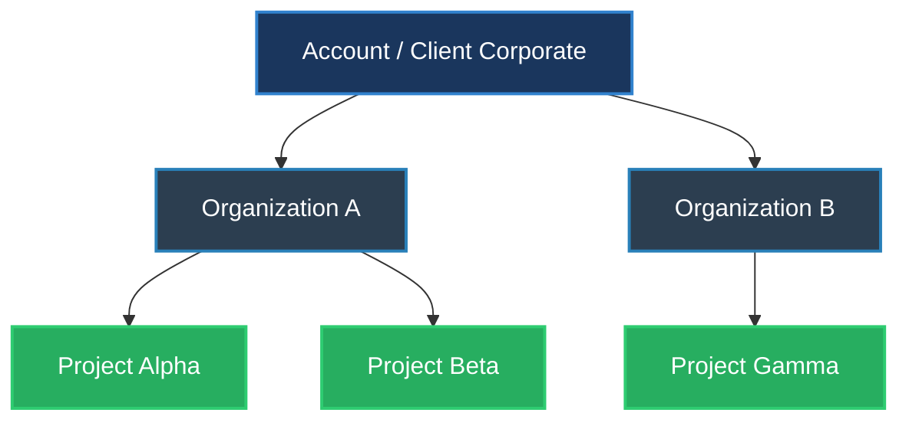

# Plan de Arhitectură Backend: Sistem Ierarhic de Date și Analytics AI (Actualizat v4)

Acest document descrie arhitectura și implementarea backend-ului pentru platforma de monitorizare și analiză, structurată ierarhic pe nivelele **Account > Organization > Project**. Această versiune este complet nativă **Google Cloud Platform (GCP)**, integrând **Google Cloud Firestore** ca bază de date NoSQL pentru metadate, rularea agenților pe **Modal**, ingestia prin **Meltano**, stocarea pe **Google Cloud Storage (GCS)** și stocarea analitică pe **Google BigQuery**.

---

## 1. Structura Ierarhică a Datelor & Tenancy

Sistemul este organizat pe 3 nivele de izolare și agregare:



### 1.1 Account (Nivelul de Facturare & Securitate Globală)
*   **Settings (Setări):** Facturare globală (Stripe/GCP Marketplace), politici SSO/MFA, loguri de audit administrative.
*   **Stats (Statistici):** Consum agregat (GCS bytes, credite Modal folosite, interogări BigQuery).

### 1.2 Organization (Nivelul Operațional & Planuri de Abonament)
*   **Plan per Organizație:** Planuri tarifare (Free, Team, Enterprise) ce limitează numărul de proiecte active, stocarea maximă și interogările API.
*   **Settings:** Membri, roluri (RBAC), API Keys globale ale organizației.
*   **Stats:** Activitate consolidată pe proiectele din organizație.

### 1.3 Project (Nivelul de Lucru / Sandbox)
*   **Settings:** Variabile de mediu securizate, prompt-uri de sistem pentru agenți, webhooks.
*   **Module Per Proiect:** Onboarding, Analytics, Integrations, Graph, Chat Sessions.

---

## 2. Ingestia de Date (Meltano) & Stocarea pe GCS

Meltano rulează ca serviciu separat (de exemplu ca joburi punctuale pe containere). 

### 2.1 Accesul Direct la GCS (Landing Zone)
*   **Meltano și Agenții Modal ACCESEAZĂ direct GCS.** Acest lucru este necesar pentru performanță (transfer rapid de fișiere mari, stream-uri de date brute).
*   **Cum se face accesul securizat:** Core API nu oferă chei statice. În schimb, generează dinamic **Signed URLs** sau **access tokeni temporari (GCP STS)** cu valabilitate scurtă (ex: 15 minute), limitați strict la prefixul proiectului:
    `gs://sentry-platform-data/org_{org_id}/proj_{project_id}/`

### 2.2 Cum se curăță (Clean-up) Object Storage-ul?
Deoarece GCS este folosit în principal ca o zonă de tranzit (Landing Zone) pentru fișierele brute extrase de Meltano înainte de a fi încărcate în BigQuery, păstrarea lor pe termen lung este inutilă și costisitoare.

1.  **GCS Lifecycle Management:**
    *   Configurăm o regulă de lifecycle la nivelul bucket-ului GCS.
    *   Toate obiectele din prefixele de tranzit (ex: `org_*/proj_*/landing_zone/`) sunt șterse automat după **7 sau 14 zile** (perioadă suficientă pentru reîncercări în caz de eroare la importul în BigQuery).
2.  **Ștergere Programatică (Post-Ingestie):**
    *   Odată ce jobul de încărcare BigQuery finalizează cu succes, scriptul wrapper Meltano poate trimite o comandă de ștergere a fișierelor procesate din prefixul respectiv din GCS.
3.  **Snapshot-uri Agenți / Memorie:**
    *   Pentru datele persistente (ex: starea grafului, fișiere de sesiune chat încărcate de utilizatori), regula de lifecycle poate fi configurată diferit (ex: mutare în clasa de stocare *Coldline* după 30 de zile și ștergere după 90 de zile, conform planului organizației).

### 2.3 Raportarea Telemetriei Meltano
*   Un script wrapper (sau sidecar orchestrator) raportează către Core API starea jobului, volumul de date ingerat și frecvența reală de sincronizare pentru a actualiza dashboard-ul de administrare și a detecta întârzierile (sincronizări eșuate).

---

## 3. Rularea Agenților AI: Platforma Modal

Agenții AI rulează pe platforma serverless **Modal** (modal.com).
1.  Core API validează drepturile utilizatorului pe proiect.
2.  Core API apelează Modal (via Webhook securizat sau SDK) transmițând contextul sesiunii (`session_id`, `project_id`, `org_id`) și credențiale temporare (tokeni STS) pentru GCS și BigQuery.
3.  Agentul pe Modal citește/scrie în folderul GCS dedicat proiectului, rulează logica AI și returnează răspunsul către client.

---

## 4. Modelul de Securitate și Izolare: Multi-Tenancy cu Google Cloud Firestore

Prin înlocuirea DynamoDB cu **Google Cloud Firestore**, integrăm baza de date tranzacțională nativ în ecosistemul GCP. Aceasta permite o organizare arborescentă nativă ce reflectă perfect structura noastră ierarhică.

```
┌──────────────────────────────────────────────────────────────────────────────┐
│                              NIVELE DE IZOLARE (GCP)                         │
├──────────────────────────────────────────────────────────────────────────────┤
│ 1. Metadata (Firestore)       -> Structură Subcolectii Ierarhice             │
├──────────────────────────────────────────────────────────────────────────────┤
│ 2. Object Storage (GCS)       -> Prefix dinamic & Tokeni Temporary IAM       │
├──────────────────────────────────────────────────────────────────────────────┤
│ 3. Analytics DB (BigQuery)    -> Dataset dedicat per Proiect                 │
├──────────────────────────────────────────────────────────────────────────────┤
│ 4. Compute (Modal Agents)     -> Sandboxing izolat cu credențiale temporare  │
└──────────────────────────────────────────────────────────────────────────────┘
```

### 4.1 Structurarea și Izolarea în Google Cloud Firestore
Firestore permite organizarea datelor sub formă de **Documente** și **Subcolectii**, fiind ideal pentru o structură arborescentă ierarhică:

*   **Designul Colecțiilor (Hierarchical Path):**
    *   Fiecare document de organizație are propriile sale subcolecții de proiecte:
        `/organizations/{org_id}` (Document Organizație)
        `/organizations/{org_id}/projects/{project_id}` (Document Proiect)
        `/organizations/{org_id}/projects/{project_id}/settings/configs` (Document Setări)
        `/organizations/{org_id}/projects/{project_id}/sessions/{session_id}` (Sesiune Chat)
*   **Garanția Securității și Izolării:**
    *   **La nivel de API Server:** Core API utilizează SDK-ul Firebase Admin. Rutele API validează JWT-ul utilizatorului și construiesc calea documentului incluzând explicit `{org_id}` și `{project_id}` extrase din contextul securizat. Este imposibil ca interogarea să "sară" în altă organizație, deoarece calea documentului este fixată prin cod.
    *   **Firestore Security Rules (opțional):** Dacă agenții de pe Modal sau din frontend accesează direct Firestore, putem defini reguli declarative de securitate bazate pe token-ul JWT (identitatea utilizatorului/agentului):
        ```javascript
        match /organizations/{orgId}/projects/{projectId}/{document=**} {
          allow read, write: if request.auth.token.org_id == orgId;
        }
        ```

### 4.2 Izolarea în Google Cloud Storage (GCS)
*   **Prefixare:** `gs://sentry-platform-data/org_{org_id}/proj_{project_id}/`.
*   Meltano și Modal accesează direct storage-ul folosind **GCP STS Tokens** generate de Core API pe baza identității organizației/proiectului active. Acest lucru previne utilizarea cheilor statice și blochează accesul în afara prefixului atribuit.

### 4.3 Izolarea în BigQuery
*   **Dataset per Proiect:** `dataset_org_{org_id}_proj_{project_id}`.
*   Modal/LLM primește roluri temporare IAM impersonate cu acces strict de citire/scriere doar pe acest dataset. Toate resursele fiind în GCP, gestiunea rolurilor temporare prin IAM se realizează cu latență minimă și fără a fi nevoie de sincronizare între furnizori diferiți de cloud (AWS-GCP).

---

## 5. Tehnologii Recomandate pentru Backend

Pentru a susține acest nivel de scalabilitate și procesare analitică:

| Componentă | Tehnologie Recomandată | Rol |
| :--- | :--- | :--- |
| **API Gateway & Core API** | Node.js (NestJS) sau Go (Gin/Fiber) | Autentificare, RBAC ierarhic, rutare rapidă, generare de tokeni temporari (GCP STS/Signed URLs). |
| **Baza de Date Tranzacțională** | Google Cloud Firestore | Stocarea metadatelor pentru Conturi, Organizații, Proiecte, Setări și Sesiuni de Chat cu structură ierarhică sub-colectată. |
| **Storage brut / ELT** | Google Cloud Storage (GCS) | Landing zone pentru Meltano și stocarea snapshot-urilor de stare ale agenților. |
| **Stocare Telemetrie / Analytics** | Google BigQuery | Dataset per proiect pentru analiză de date pe termen lung. |
| **Real-time Analytics Hot Path** | ClickHouse sau BigQuery BI Engine | Interogări ultra-rapide sub-secundă pentru dashboard-urile live din UI. |
| **Vector & Graph DB** | Neo4j + pgvector (sau Pinecone) | Generarea grafului de relații din proiect și RAG (Retrieval-Augmented Generation). |
| **Orchestrare Ingestie** | Meltano + Temporal.io (sau Prefect) | Ingestia de date cu heartbeat și raportare de telemetrie de sincronizare. |
| **Platforma de Compute Agenti** | Modal (modal.com) | Rularea serverless, izolat și securizat a agenților LLM. |

---

## 6. Etapele de Implementare (Roadmap)

### Faza 1: Baza de date și Multi-Tenancy în Firestore (Săptămânile 1-3)
*   Proiectarea schemei Firestore folosind structura de subcolecții ierarhice.
*   Implementarea middleware-ului de context pentru asigurarea injectării automate a calei `/organizations/{org_id}/projects/{project_id}` în toate interogările Core API.
*   Crearea fluxului de invitații, RBAC (roluri) și management de planuri tarifare per organizație.

### Faza 2: Ingestia Meltano & Landing Zone GCS (Săptămânile 4-6)
*   Configurarea bucket-ului central GCS și a regulilor de lifecycle pentru curățarea automată (la 7/14 zile) a folderelor `/landing_zone/`.
*   Implementarea microserviciului de generare de signed URLs / STS tokens temporari pentru Meltano.
*   Dezvoltarea sistemului de raportare a telemetriei (start, heartbeat, volum, erori) de către conectorii Meltano.

### Faza 3: Rularea Agenților pe Modal (Săptămânile 7-9)
*   Configurarea aplicației Modal și a webhook-urilor de execuție securizată.
*   Integrarea fluxului de credențiale temporare (STS) trimise către containerele Modal pentru a citi din GCS și Firestore.
*   Crearea API-ului de streaming pentru chat-ul agenților.

### Faza 4: BigQuery Dataset per Proiect (Săptămânile 10-12)
*   Implementarea fluxului automat de provizionare a unui dataset BigQuery nou la crearea unui proiect.
*   Configurarea permisiunilor dinamice IAM (Service Account Impersonation) la nivel de dataset BigQuery.
*   Implementarea dashboard-urilor standard folosind interogări BigQuery optimizate cu BI Engine.

### Faza 5: LLM Sandbox Query Engine (Săptămânile 13-15)
*   Dezvoltarea interpretorului de query-uri (care rulează în sandbox-ul izolat) ce convertește cererile utilizatorilor în cod de analiză.
*   Implementarea parserului de Vega-Lite în Frontend pentru randarea graficelor dinamice generate de LLM.
