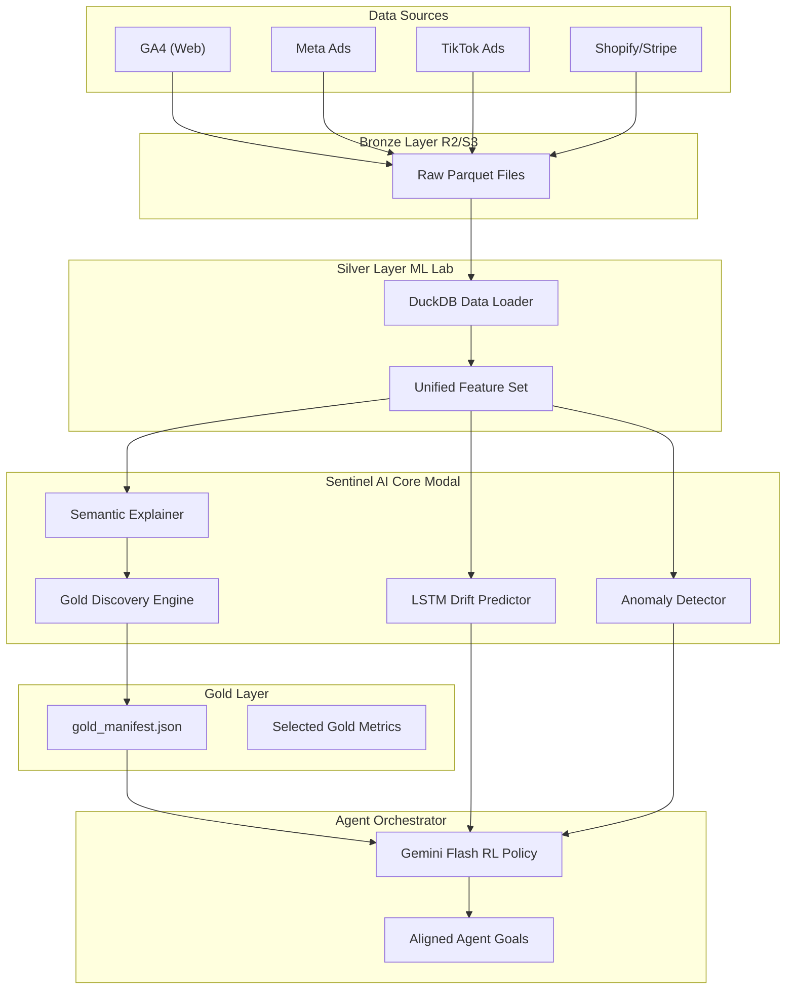

# Sentinel AI - ML Lab Guide

Acest document sumarizează arhitectura sistemului Sentinel, comenzile disponibile și cerințele de date pentru antrenare și inferență.

## 🏗️ System Architecture



---

## 🚀 Comenzi Disponibile

### 1. Training pe Modal (GPU)
Rulează antrenarea modelului LSTM și generarea manifestului Gold pe infrastructura Modal.
```bash
modal run ml-lab/modal_training.py
```

### 2. Demo Auto-Discovery (Gold Layer)
Observă cum sistemul alege automat cele mai importante metrici din surse multiple.
```bash
python3 ml-lab/core/gold_discovery.py
```

### 3. Demo Self-Healing
Simulează o eroare de transformare (NULLs/Scale) și vezi cum Sentinel generează un fix.
```bash
python3 ml-lab/self_healing_demo.py
```

### 4. Demo Goal Alignment
Vezi cum insights-urile de ML sunt traduse în task-uri concrete pentru alți agenți.
```bash
python3 ml-lab/align_demo.py
```

### 5. Generare bundle de antrenare
Pregătește dataset-uri multi-domain pentru detectie de domenii, recomandare de widget-uri, query/script generation și feedback RL.
```bash
python3 ml-lab/datasets/generate_bundle.py --output-dir ml-lab/datasets/training_bundle --rows-per-source 240
```

---

## 📊 Date pentru Antrenare

### Format Ideal: **Apache Parquet**
Sistemul este optimizat pentru Parquet via DuckDB. Fișierele ar trebui să fie stocate în `datasets/parquet/` sau într-un bucket R2.

### Structură Recomandată
| Coloană | Format | Note |
| :--- | :--- | :--- |
| `timestamp` | `datetime64` | Esențial pentru Drift (LSTM) |
| `*_spend_*` | `float` | Detectat automat ca `marketing_metric` |
| `*_revenue` | `float` | Detectat automat ca `financial_metric` |
| `*_id` | `string` | Detectat ca `entity_id` (ignorat în Gold KPIs) |

---

## ✨ Gold & Insights Definition

### Gold Manifest (`gold_manifest.json`)
Este generat automat de antrenament. Poți să-l editezi manual pentru a forța anumite metrici în Gold Layer.
- **selected_metrics**: Lista de coloane care vor apărea pe dashboard-ul final.
- **ontology_mapping**: Rolul semantic dedus de modelul `data_explainer`.

### Insights
Sistemul generează două tipuri de insights:
1. **Business Drift**: Schimbări de trend pe termen lung (LSTM).
2. **Technical Anomaly**: Erori de execuție sau transformare (Isolation Forest + Heuristics).

Toate aceste insights sunt agregate de `GeminiFlashEngine` pentru a produce **Aligned Goals**.

### Training bundle extins
Generatorul din `ml-lab/datasets/` poate materializa:
- surse sintetice pentru SaaS, product analytics, web analytics, marketing, commerce, sales, support, observability, FinOps, cybersecurity și IoT;
- spec-uri ideale pentru field-uri, cu reguli de validare, normalizare și mapare către widget-uri;
- un catalog de 44 widget-uri analitice pentru selecție automată;
- scenarii de antrenare pentru agenți care trebuie să producă SQL/Python profesional;
- profile și evenimente de reinforcement learning pentru multi-point clustering și adaptare colectivă per field.
