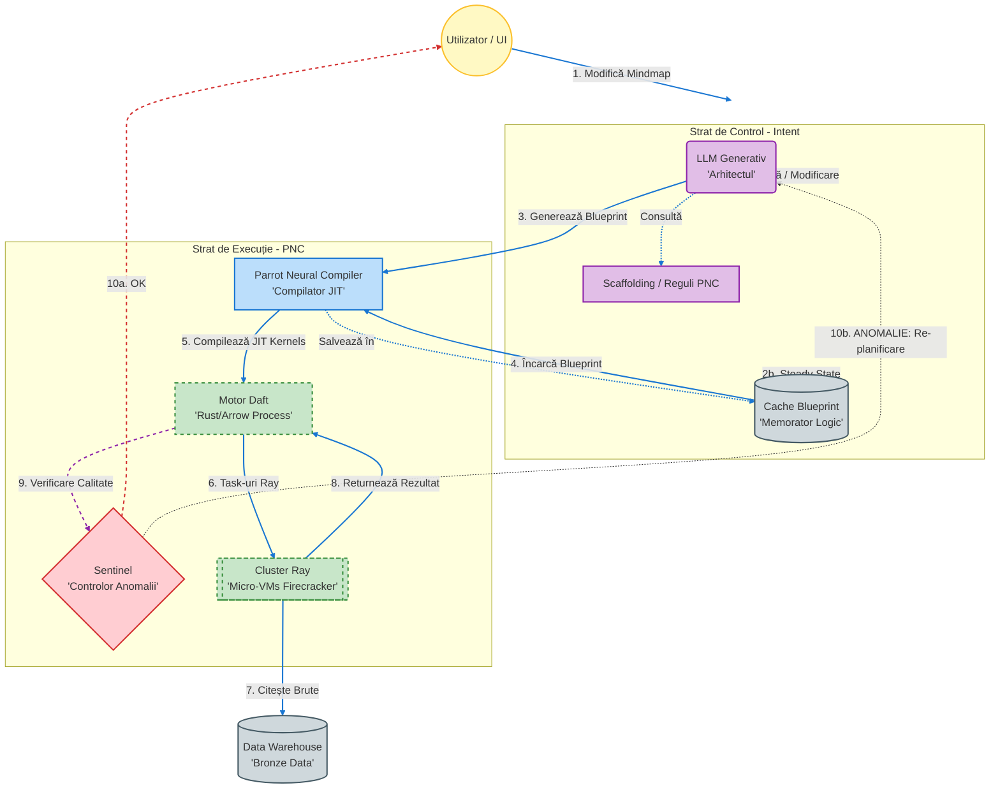

```mermaid
graph TD
    %% --- Stiluri pentru claritate ---
    classDef user fill:#fff9c4,stroke:#fbc02d,stroke-width:2px;
    classDef llm fill:#e1bee7,stroke:#8e24aa,stroke-width:2px;
    classDef pnc fill:#bbdefb,stroke:#1976d2,stroke-width:2px;
    classDef engine fill:#c8e6c9,stroke:#388e3c,stroke-width:2px,stroke-dasharray: 5 5;
    classDef storage fill:#cfd8dc,stroke:#455a64,stroke-width:2px;
    classDef anomaly fill:#ffcdd2,stroke:#d32f2f,stroke-width:2px;

    %% --- Noduri ---
    User((Utilizator / UI)):::user
    
    subgraph Control_Plane [Strat de Control - Intent]
        LLM(LLM Generativ <br/>'Arhitectul'):::llm
        Cache[(Cache Blueprint <br/>'Memorator Logic')]:::storage
        Scaffold[Scaffolding / Reguli PNC]:::llm
    end

    subgraph Execution_Plane [Strat de Execuție - PNC]
        PNC[Parrot Neural Compiler <br/>'Compilator JIT']:::pnc
        Sentinel{Sentinel <br/>'Controlor Anomalii'}:::anomaly
        Daft[Motor Daft <br/>'Rust/Arrow Process']:::engine
        RayCompute[[Cluster Ray <br/>'Micro-VMs Firecracker']]:::engine
    end

    Warehouse[(Data Warehouse <br/>'Bronze Data')]:::storage

    %% --- Flux Logica ---

    %% Pasul 1: Intenția
    User ==>|1. Modifică Mindmap| Control_Plane

    %% Pasul 2: Alegere Path (LLM vs Cache)
    Control_Plane -->|2a. Prima dată / Modificare| LLM
    Control_Plane -->|2b. Steady State| Cache

    %% Pasul 3: Generare Blueprint
    LLM -.->|Consultă| Scaffold
    LLM ==>|3. Generează Blueprint| PNC
    PNC -.->|Salvează în| Cache

    %% Pasul 4: Execuție Rapidă
    Cache ==>|4. Încarcă Blueprint| PNC
    PNC ==>|5. Compilează JIT Kernels| Daft
    
    %% Pasul 5: Procesare On-the-Fly
    Daft ==>|6. Task-uri Ray| RayCompute
    RayCompute ==>|7. Citește Brute| Warehouse
    RayCompute ==>|8. Returnează Rezultat| Daft

    %% Pasul 6: Loop de Feedback (Sentinel)
    Daft ==>|9. Verificare Calitate| Sentinel
    
    %% Pasul 7: Finalizare sau Corecție
    Sentinel ==>|10a. OK| User
    Sentinel -.->|10b. ANOMALIE: Re-planificare| LLM

    %% --- Stilizare linii ---
    linkStyle 0,1,3,4,5,6,7,8,9,10 stroke:#1976d2,stroke-width:2px;
    linkStyle 2,11 stroke:#8e24aa,stroke-width:2px,stroke-dasharray: 5 5;
    linkStyle 12 stroke:#d32f2f,stroke-width:2px,stroke-dasharray: 5 5;
```