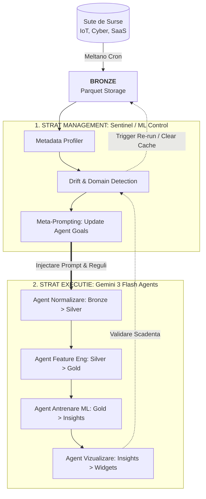

```mermaid
graph TD
    %% Sursa de Date
    S[(Sute de Surse<br/>IoT, Cyber, SaaS)] -->|Meltano Cron| B[<b>BRONZE</b><br/>Parquet Storage]

    %% Primul Grup: STRATUL DE MANAGEMENT (Sentinel)
    subgraph Sentinel_Management [1. STRAT MANAGEMENT: Sentinel / ML Control]
        direction LR
        MD[Metadata Profiler] --> Drift[Drift & Domain Detection]
        Drift --> Goal[Meta-Prompting: Update Agent Goals]
    end

    %% Legătura de Control Verticală
    B --> MD
    Goal ==>|Injectare Prompt & Reguli| A1

    %% Al doilea Grup: STRATUL AGENTIC (Execuție) - SUB MANAGEMENT
    subgraph Agent_Execution [2. STRAT EXECUTIE: Gemini 3 Flash Agents]
        direction TB
        A1[Agent Normalizare: Bronze > Silver] --> A2[Agent Feature Eng: Silver > Gold]
        A2 --> A3[Agent Antrenare ML: Gold > Insights]
        A3 --> A4[Agent Vizualizare: Insights > Widgets]
    end

    %% Bucla de Auto-Reglare (Feedback de jos în sus)
    A4 -.->|Validare Scadenta| Drift
    Drift -.->|Trigger Re-run / Clear Cache| B
```