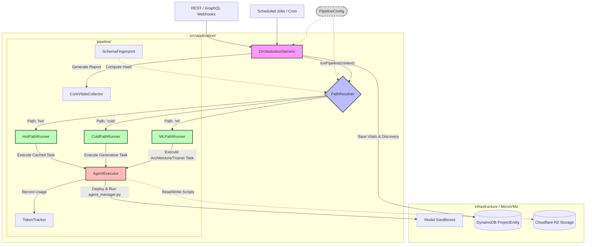

# Application Layer Architecture

This document describes the core architecture of the `sentry-backend` application layer, specifically focusing on the data pipeline orchestration and agent execution flow.

## Component Overview

### Core Orchestration
- **`OrchestrationService`**: The entry point for all pipeline executions. It acts as a thin coordinator, receiving a trigger, invoking the `PathResolver`, and delegating the actual work to the appropriate runner based on the resolved path. It handles saving the final discovery metadata and telemetry vitals to the database.
- **`PipelineConfig`**: A centralized configuration file used to manually override pipeline behavior (e.g., force a Hot Path run for development purposes, disable ML paths for quick testing).

### Pipeline Resolution
- **`PathResolver`**: Analyzes the `PipelineContext` (tenant, project state, schema hashes) to determine the optimal execution path:
    - Checks if forced validation is requested.
    - Uses **`SchemaFingerprint`** to detect schema drift (Cold Path).
    - Checks script cache validity (Hot Path).
    - Checks scheduling configurations (ML Path).

### Path Runners
- **`HotPathRunner`**: Executes the pipeline entirely from verified, cached scripts stored in R2. Zero LLM tokens are used. Fastest execution path.
- **`ColdPathRunner`**: The fallback when schemas change or cache is missed. Runs the full generative DAG, including Source Classification and structural data discovery (Bronze -> Silver -> Gold).
- **`MLPathRunner`**: Specialized runner for executing advanced modeling. Operates in two steps: 
    1. Runs the *ML Architect* to strategically decide the model type (Regression, Classification, etc.).
    2. Runs the *ML Trainer* by injecting the corresponding boilerplate python snippet.

### Agent Execution & Auditing
- **`AgentExecutor`**: The crucial link between the Node.js backend and the isolated microVMs (Modal). It handles the sandbox lifecycle, injects variables, executes the python scripts, catches standard output, and maps standard print logs (`AGENT_DISCOVERY`, `AGENT_RESULT`) back into structured TypeScript objects.
- **`TokenTracker`**: Estimates token usage based on the log byte size outputted by `AgentExecutor` and records it for billing/informational purposes.
- **`CoreVitalsCollector`**: Aggregates latency, cache hit rates, and pathway choices into a final report saved on the project.
