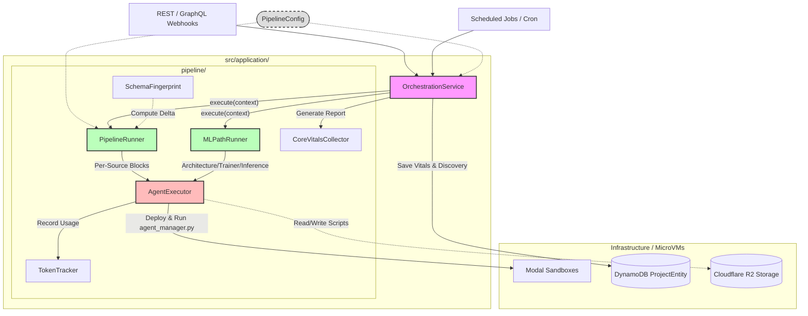

# Application Layer Architecture

This document describes the core architecture of the `sentry-backend` application layer, specifically focusing on the unified data pipeline orchestration.

## Component Overview

### Core Orchestration
- **`OrchestrationService`**: The primary coordinator. It triggers the `PipelineRunner` for the ETL phase and optionally the `MLPathRunner` for predictions. It manages high-level discovery aggregation and telemetry persistence.
- **`PipelineConfig`**: Centralized configuration for feature toggles (e.g., enabling/disabling the ML path).

### Smart Execution
- **`PipelineRunner`**: The "brain" of the ETL phase. It uses **`SchemaFingerprint`** to detect schema drift or new sources and executes parallel ETL blocks (Normalization -> Feature Engineering) for each source. It identifies cache hits vs misses per-source, ensuring minimal token usage for existing data.
- **`MLPathRunner`**: Specialized runner for executing advanced modeling. It designs strategy (Architect), trains models (Trainer), and generates predictions (Inference) in a unified, multi-source aware manner.

### Agent Execution & Auditing
- **`AgentExecutor`**: The bridge to isolated microVMs (Modal). It handles script deployment, environment injection, and maps agent outputs (`AGENT_DISCOVERY`, `AGENT_RESULT`) back to the application context.
- **`TokenTracker`**: Audits and estimates token consumption from LLM-driven tasks.
- **`CoreVitalsCollector`**: Collects performance metrics and execution details for each pipeline run.
